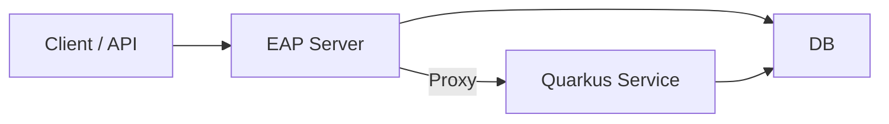

# Kitchen Sink Path to Modernisation

## Kitchen Sink Requirements

### UI

- Ability to register name, email and phone number
    - Field level validations for name, email and phone
    - Unique constraint on email
- List members on the UI

### API

- API POST Register Member with validation
- API GET Member List
- API GET Member by ID

### Infrastructure

- Deploy onto OpenShift
- Integration tests which run against deployed server

### Technical Stack

JBoss EAP 8.0 - JSF, CDI, JAX-RS, EJB, JPA, and Bean Validation

## Process of Migration

### Tools used

- gpt-4o
- claude-3.5-sonnet
- Redhat MTA
    - Couldn't actually get this running but the tool looks to be useful to analysis of Java applications and had
      support
      for JBoss 8 to Quarkus migration

### Library Evaluation

Evaluation was done to compare Quarkus and Spring Boot as target frameworks
for the migration. The libraries were evaluated before:

| JBoss EE Component | Quarkus Migration | Spring Boot Migration |
|--------------------|-------------------|-----------------------|
| JSF                | Qute              | Thymeleaf             |
| CDI                | Keep CDI          | Switch to Spring DI   |
| JPA                | Keep JPA          | Spring Data JPA       |
| JAX-RS             | REST              | Spring MVC/WebFlux    |
| Bean Validation    | Keep Bean Valid.  | Spring Validation     |
| EJB                | CDI Beans         | Spring Components     |

After evaluation from online resources I made the choice to go with Quarkus as it follows Jakarta EE conventions
and has similar libraries which can be a drop in replacement. Although the spring library ecosystem
is larger, my assessment here is that if the developers are used to writing in Jakarta EE it will be an easier shift
to start using Quarkus.

### Migration deployment



To make this an iterative approach the plan is to develop and deploy the quarkus service which will run in parallel to
the JBoss application while the migration is done. Quarkus service will start to reimplement the existing APIs which
then the JBoss Server will proxy the requests.

### Alternative approaches

- Instead of a proxy this could've also been achieved using an API gateway which would forward the migrated API requests
  to the new service. Decision was made to go with the proxy because it could be implemented in this exercise without
  other cloud considerations.

## Process of Migration

### Assumptions Made

- Code modernisation will happen in the current repository and developers will iteratively migrate to Quarkus
- For this example the embedded h2 db is used, assume there is some deployed DB which both Quarkus service and Jboss EAP
  will connect to and for the duration of the migration the same DB is used.
- Assumption is that during the migration the application is expected to remain in a working state.

### Steps to Modernisation

1. Break down the project into submodules Introduce Quarkus Dependencies and update to use Java 17

```
kitchensink/
├── kitchensink-eap/     # JBoss EAP module
├── kitchensink-quarkus/ # Quarkus module
└── kitchensink-model/  # Shared code
```

Assumption here is that using maven we can easily package each application and deploy it onto openshift.

2. Start by updating one API resource at a time migrating over

For this example there is only one resource but the migration was done in a way such that if there were several APIs
they could be migrated iteratively. The proxying is done inside
[Quarkus Proxy Filter](kitchensink-eap/src/main/java/com/example/proxy/QuarkusProxyFilter.java) which forwards the
requests.
For the purpose of the exercise this is a very basic implementation.

As the APIs were migrated over unit tests and integration tests were written.

3. Migrate UI

To not overcomplicate things I have gone with Quarkus Qute as the templating engine and kept the UI as a server rendered
template. The html template was translated over the Qute template format using claude.

4. Remove JBoss dependency & Java 21

Since this was the last remaining piece we can now consolidate down the modules and remove the `kitchesink-eap` module
and move the models into the `kitchensink-quarkus` project. Once migrated I can now update the Java version to 21

5. Migrate to MongoDB

This was done as a last step to first modernise and then migrate to MongoDB, I have updated the repository layer and
assumption here is for the switch over there was allowed downtime so a snapshot migration is sufficient and the mongodb
version of the app can be deployed

### Findings / Notes

- Initial attempted was to see if quarkus dependency could be introduced and run in the same executable but quickly
  decided that would be too messy and there were version conflicts with the underlying dependencies

