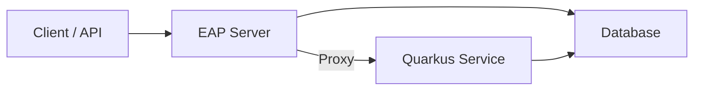

# Kitchen Sink Path to Modernization

## Kitchen Sink Requirements

### UI

- Ability to register name, email, and phone number
    - Field-level validations for name, email, and phone
    - Unique constraint on email
- Display a list of registered members on the UI

### API

- **POST /members** - Register a new member with validation
- **GET /members** - Retrieve a list of members
- **GET /members/{id}** - Retrieve a member by ID

### Infrastructure

- Deploy onto OpenShift
- Run integration tests against the deployed server

### Technical Stack

- **Current Stack**: JBoss EAP 8.0 with JSF, CDI, JAX-RS, EJB, JPA, and Bean Validation

## Migration Process

### Assumptions

- The modernization will occur **within the existing repository**, and developers will iteratively migrate services to
  Quarkus.
- The embedded **H2 database** is used for development, but the assumption is that a deployed database will be shared by
  both Quarkus and JBoss EAP during migration.
- The application must **remain functional** throughout the migration.

### Tools Used

- **Cursor** - **gpt-4o** & **claude-3.5-sonnet**
    - Used extensively to assist with code translation, template conversion (e.g., JSF to Qute), and generation of
      migration strategies.
    - Enabled faster discovery of library equivalents and coding patterns, reducing manual lookup times.

### Library Evaluation

A comparison was performed between Quarkus and Spring Boot to determine the best target framework for migration. The
evaluation considered the existing Java EE components and their equivalents in both frameworks:

| JBoss EAP Component | Quarkus Migration    | Spring Boot Migration |
|---------------------|----------------------|-----------------------|
| JSF                 | Qute                 | Thymeleaf             |
| CDI                 | Keep CDI             | Switch to Spring DI   |
| JPA                 | Keep JPA             | Spring Data JPA       |
| JAX-RS              | RESTEasy             | Spring MVC/WebFlux    |
| Bean Validation     | Keep Bean Validation | Spring Validation     |
| EJB                 | CDI Beans            | Spring Components     |

After evaluating online resources, Quarkus was chosen as the target framework. This decision was based on Quarkus'
adherence to **Jakarta EE conventions**, making it a smoother transition for developers already familiar with Java EE.
While Spring Boot offers a larger library ecosystem, Quarkus provides more **drop-in replacements** for Java EE
components.

## Deployment Strategy

### Incremental Migration Plan



To facilitate an **incremental migration**, the Quarkus service will be developed and deployed alongside the existing
JBoss EAP application. The JBoss EAP server will proxy API requests to the new Quarkus service as each component is
migrated.

### Alternative Approaches

- Instead of using a **proxy**, an API Gateway (e.g., Kong, NGINX, Istio) could forward requests to the new Quarkus
  service.
- The proxy approach was chosen for this exercise to minimize infrastructure complexity and avoid additional cloud
  dependencies.

## Migration Process

### Steps to Modernization

#### 1. Introduce a Multi-Module Structure & Upgrade to Java 17

```
kitchensink/
├── kitchensink-eap/     # JBoss EAP module
├── kitchensink-quarkus/ # Quarkus module
└── kitchensink-model/   # Shared model and utilities
```

- This structure allows parallel development and ensures that common models remain accessible to both applications.
- Maven is used to package and deploy both applications onto OpenShift.

#### 2. Incrementally Migrate API Endpoints

- Migrate **one API resource at a time** to the Quarkus service.
- A **Quarkus Proxy Filter** (`QuarkusProxyFilter.java`) inside the JBoss EAP application forwards API requests to
  Quarkus.
- Unit tests and integration tests are written alongside the migration.
- Dependency Injection:
    - JBoss EAP: Utilized @Inject from javax.inject.
    - Quarkus: Continues to use @Inject, but also leverages additional Quarkus features.
- Path Annotations:
    - JBoss EAP: Typically used @Path from javax.ws.rs.
    - Quarkus: Uses @Path from jakarta.ws.rs, reflecting the shift to Jakarta EE namespaces.
- Validation Annotations:
    - JBoss EAP: Used @NotNull, @NotEmpty, and @Digits from javax.validation.constraints.
    - Quarkus: Updated to use @NotBlank, @Email, and @Size from jakarta.validation.constraints, simplifying
      validation
      logic
      and improving clarity.
- Transactional Annotations:
    - JBoss EAP: Used @Transactional from javax.transaction.
    - Quarkus: Continues to use @Transactional, but with improved integration in the Quarkus ecosystem.
- Service Annotations:
    - JBoss EAP: Used @Stateless for EJBs.
    - Quarkus: Transitioned to @ApplicationScoped for CDI beans, simplifying the component model.

#### 3. Migrate the UI

- The **JSF UI** is replaced with **Qute**, Quarkus’ templating engine, to maintain server-side rendering.
- The HTML templates were translated into Qute templates using **Claude**.

#### 4. Remove JBoss Dependency & Upgrade to Java 21

- Once all APIs and UI components are migrated, **the JBoss EAP module is removed**.
- The **models are merged into the Quarkus project**.
- The application is updated to **Java 21** to leverage newer features and optimizations.

#### 5. Migrate to MongoDB

- The **relational database is replaced with MongoDB**, updating the repository layer to use **Panache MongoDB**.
- A **data migration** using Relational Migrator is performed and assumed to be working.
- The new Quarkus application is deployed with MongoDB as the primary data source.

### Key Findings & Lessons Learned

- AI Acceleration: Significant time savings in both code refactoring and documentation.
- **Introducing Quarkus dependencies into the existing JBoss EAP application was impractical** due to version conflicts
  and dependency mismatches.
- **Proxying through JBoss EAP was an effective interim solution**, allowing gradual migration without disrupting the
  application.
- **An API Gateway could have been a more scalable alternative**, but it was not necessary for this specific exercise.
- **Qute was a simple and effective replacement for JSF**, making the UI migration relatively straightforward.
- **RedHat Migration Toolkit for Applications (MTA)**
    - Could not successfully run MTA, but it appeared to be a useful tool for analyzing Java applications and supporting
      JBoss EAP 8 to Quarkus migration.

## Conclusion

The migration from **JBoss EAP to Quarkus** was achieved through an **incremental, low-risk approach** by running the
applications side-by-side and proxying requests. This method allowed for:

- **Minimal downtime**
- **Gradual API and UI transition**
- **Seamless database integration**


